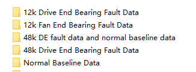
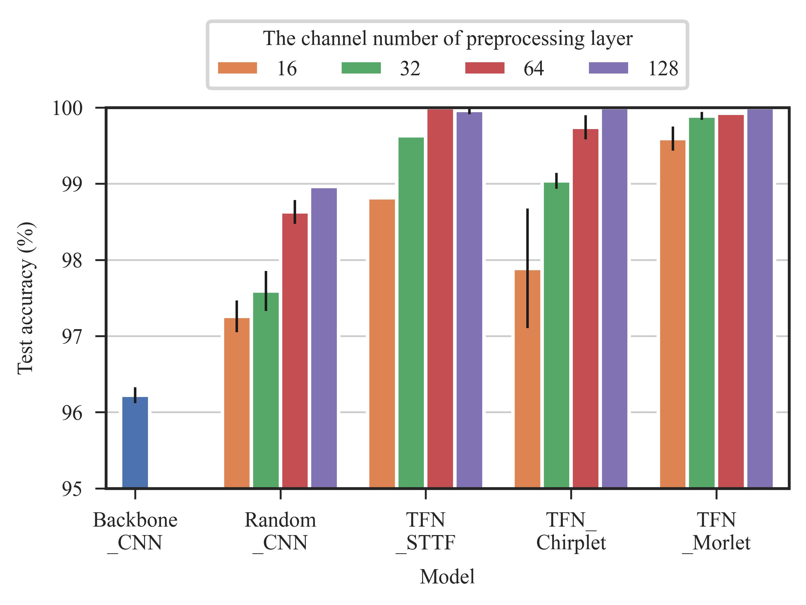

# TFN


This is the open code of paper entitled **"TFN: An Interpretable Neural Network With Time Frequency Transform Embedded for Intelligent Fault Diagnosis"**.
> Convolutional neural networks (CNNs) are widely used in fault diagnosis of mechanical systems due to their powerful feature extraction and classification capabilities. However, the CNN is a typical black-box model, and the mechanism of CNN's decision-making is not clear, which limits its application in high-reliability-required fault diagnosis scenarios. To tackle this issue,  we propose a novel interpretable neural network termed as time-frequency network (TFN), where the physically meaningful time-frequency transform (TFT) method is embedded into the traditional convolutional layer as a trainable preprocessing layer. This preprocessing layer named as time-frequency convolutional (TFconv) layer, is constrained by a well-designed kernel function to extract fault-related time-frequency information. It not only improves the diagnostic performance but also reveals the logical foundation of the CNN prediction in a frequency domain view. Different TFT methods correspond to different kernel functions of the TFconv layer. In this study, three typical TFT methods are considered to formulate the TFNs and their diagnostic effectiveness and interpretability are proved through three mechanical fault diagnosis experiments.  Experimental results also show that the proposed TFconv layer has outstanding advantages in convergence speed and few-shot scenarios, and can be easily generalized to other CNNs with different depths to improve their diagnostic performances.
---

* The preprint version is available on [Arxiv](https://arxiv.org/abs/2209.01992);
* The final version is published on [Mechanical System and Signal Processing (MSSP)](https://www.sciencedirect.com/science/article/pii/S0888327023008609).

### Notes

* **(Dec 25, 2023)**: An extra-supplimentary material about the interpretability is added as `Doc/ExtraSupplimentaryMaterial.pptx`;

## Repo structure

The core code of TFN is shown in `Models/TFconvlayer.py` and `Models/TFN.py`. **You can just read these two files if you only care about our implementation.**

Besides, I definately know the difficulty for a beginer to reproduce other people`s works, to help the beginers, **I also provide a full pipeline** based on [DL-based-Intelligent-Diagnosis-Benchmark](https://github.com/ZhaoZhibin/DL-based-Intelligent-Diagnosis-Benchmark) to conduct the acurracy experiment on CWRU dataset.

The repo structure is organized as follows:
* `checkpoint`: storage of training results
* `Datasets`: code of dataset preparation (CWRU included only)
* `Models`: code of models (Backbon-CNN, Random-CNN, TFN-STTF, TFN-Chirplet, TFN-Morlet included)
* `PostProcess`: A full pipeline to conduct the accuracy experiments on CWRU dataset, including **`PostProcess/TrainSequentially.py`** (train models sequentially) and  **`PostProcess/Acc_statistic.py`**: (statistic and plot the results)
* `utils`: basic functions
* **`main.py`**: the main file

## How to run?

### Dataset: 

[CWRU Bearing Dataset](https://csegroups.case.edu/bearingdatacenter/pages/download-data-file/) (Ps: The official CWRU dataset website got something wrong, but it's not difficult to obtain this dataset from other resource.)

Download the CWRU Dataset (organized as below):




### Requirement:
```
pytorch
numpy
pandas
matplotlib
seaborn
scipy
scikit-learn
openpyxl
```
For reference:
```
conda create -n env-TFN python=3.8.16
conda activate env-TFN
conda install pytorch==2.0.0 torchvision==0.15.0 torchaudio==2.0.0 pytorch-cuda=11.8 -c pytorch -c nvidia
conda install pandas matplotlib seaborn scipy scikit-learn openpyxl
```

### Run a single training on CWRU dataset:

* Download CWRU dataset and set the dataset directory rightly in `main.py`
* Run the `main.py`  ( for example:  `python main.py --data_dir <CWRU dir>` )
* In addition, you can customize the training args by editing `main.py`. (choose different models, different channel numbers of preprocess layer, etc.)


### Run the full pipeline of the accuracy experiment on CWRU dataset:
* Download CWRU dataset and set the dataset directory rightly in the `main.py` file
* Run `PostProcess/TrainSequentially.py` to train models sequentially (Result is located in `checkpoint/Acc-CWRU`)
* Run `PostProcess/Acc_statistic.py` to statistic and plot the results (Result is located in `checkpoint/Acc-CWRU/postfiles`)


The result of accuracy experiment on CWRU dataset is shown as follows:



## Citation
Please cite our paper when our code is helpful to you: 
```
@article{CHEN2024110952,
title = {TFN: An interpretable neural network with time-frequency transform embedded for intelligent fault diagnosis},
journal = {Mechanical Systems and Signal Processing},
volume = {207},
pages = {110952},
year = {2024},
doi = {https://doi.org/10.1016/j.ymssp.2023.110952},
author = {Qian Chen and Xingjian Dong and Guowei Tu and Dong Wang and Changming Cheng and Baoxuan Zhao and Zhike Peng}
}
```

## Contact
* chenqian2020@sjtu.edu.cn & [Homepage of Qian Chen](https://chenqian0618.github.io/Homepage/).

